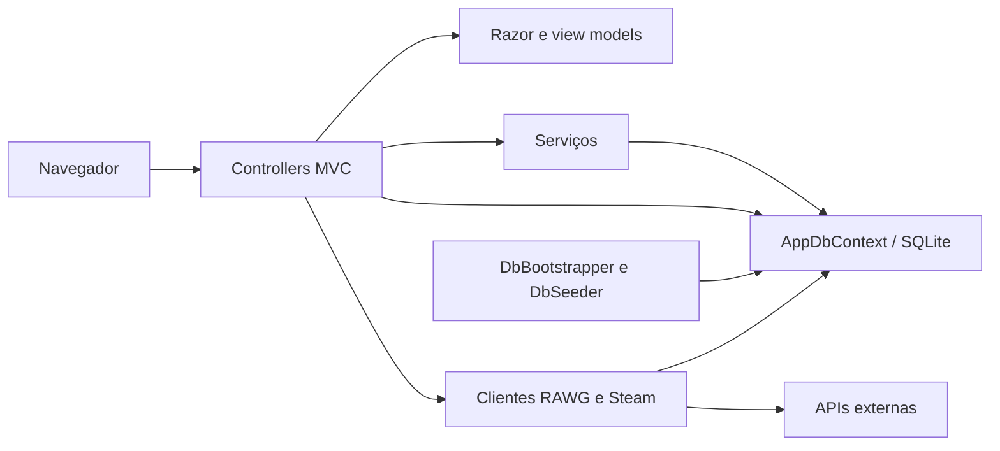

# Arquitetura e dados

## Visão geral

Aplicação única .NET 10 renderizando HTML no servidor. Não há SPA, API pública separada, worker de sincronização ou fila. Formulários MVC usam cookies Identity e tokens antiforgery.

## Mapa

| Local | Responsabilidade |
|---|---|
| Program.cs | DI, Identity, SQLite, HttpClient, middleware e rotas |
| Controllers | Requisições, autorização, consultas e chamadas de serviços |
| Services/LibraryService.cs | Biblioteca, atividades e notificações de resenha |
| Services/FollowService.cs | Relações sociais e eventos |
| Services/NotificationService.cs | Consultas e marcação de notificações |
| Services/CoverSvg.cs e Ui.cs | SVGs e rótulos de tempo |
| Data | Contexto, bootstrap e seed |
| Domain | Entidades e enums |
| Integrations | Interfaces, DTOs privados e clientes reais/demo |
| Models | View models e validações |
| Views e wwwroot/css | Razor, JS de estrelas e estilos |
| Migrations | Migration inicial e snapshot EF |

Controllers também acessam o contexto diretamente; há duplicação entre LibraryController e LibraryService. As pastas não são camadas isoladas por projetos.

## Modelo

| Entidade | Dados e relações |
|---|---|
| ApplicationUser | IdentityUser + DisplayName, Bio, AvatarUrl, SteamId, LastSteamSyncAt |
| Game | Metadados, imagens, Metacritic e IDs opcionais IGDB/RAWG/Steam |
| UserGame | Usuário/jogo, status, nota, resenha, horas inteiras, favorito, datas |
| Achievement | Jogo, ExternalId, nome, descrição, ícone, raridade |
| UserAchievement | Usuário/conquista e data de desbloqueio |
| Follow | Seguidor, seguido, data |
| Activity | Usuário, jogo opcional, tipo, texto já formatado, data |
| Notification | Destinatário, texto, link, leitura, data |

Índices únicos: UserGame(UserId, GameId), Follow(FollowerId, FolloweeId), UserAchievement(UserId, AchievementId), além dos próprios do Identity.

Não há unicidade configurada para RawgId, SteamAppId, nome de jogo ou Achievement(GameId, ExternalId). Deduplificação externa depende do código e precisa de revisão de concorrência.

Gêneros/plataformas são strings separadas por vírgulas. Datas são atribuídas em UTC e várias telas usam ToLocalTime(), portanto dependem do fuso do processo servidor.

Excluir Game elimina UserGames e Achievements; estes eliminam UserAchievements. Activity.Game usa SetNull. Outras relações configuradas no contexto usam cascata.

## Inicialização

DbBootstrapper aplica MigrateAsync e roda DbSeeder em um escopo. O seed importa catálogo se vazio, preenche algumas notas Metacritic estáticas, cria conquistas genéricas, contas demo/admin, relações, bibliotecas e eventos.

As condições são em grande parte globais por tabela (AnyAsync), não por registro. O seed roda em todo boot, em qualquer ambiente; não deve ser tratado como reconciliação de produção.

## Interface e escala

Layout escuro, acento verde-água, Inter/Outfit e Tailwind via CDN. SVGs são respostas geradas em memória, não arquivos gravados em wwwroot.

Home e catálogo carregam todos os jogos e UserGames relacionados antes de ordenar/filtrar. Perfil e biblioteca não paginam. Administração pagina no banco. Sincronizações fazem múltiplas consultas e saves. Evoluções devem preservar comportamento e medir consultas.
